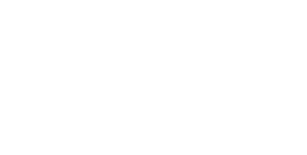

<p align="center">
  
</p>

<details>
  <summary>Table of contents</summary>

  - [About Prophetic Eye](#about-prophetic-eye)
  - [How to run it?](#how-to-run-it)
  - [What is happening behind?](#what-is-happening-behind)
  - [Built in](#built-in)
</details>


# <ins>About Prophetic Eye</ins>
- A platform that combines the best qualities of Ravn's team members with the client's project requirements to create the perfect match for seamless collaboration.

# <ins>How to run it?</ins>
- Must to python installed
- Must create virtual environment:
```shell
  python -m venv venv
```
- Install dependencies running:
```shell
  pip install -r requeriments.txt
```
- Replace .env.example by .env and set your own key
- Run the server:
```shell
  python -m app
```


# <ins>What is happening behind</ins>

The project involves gathering information about the client, specifically about their project. Then, a Ravn team member will fill out a short form where they can add one or multiple projects, providing descriptions of what they did and used in those projects, including the technologies, their level of English, their background, and their communication skills.

This data is sent to the backend, where we have utilized OpenAI’s service for data mapping, specifically leveraging ChatGPT Completion and ChatGPT Embeddings. This enables a detailed analysis of which team member is best suited to participate in the project and why. A carefully selected top list is presented based on performance and technical compatibility, enabling the partner to quickly choose the right person for the job.

# <ins>Built in</ins>


